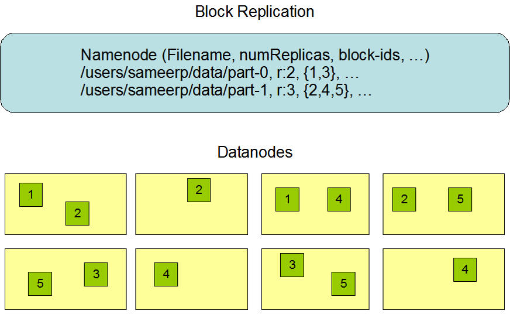
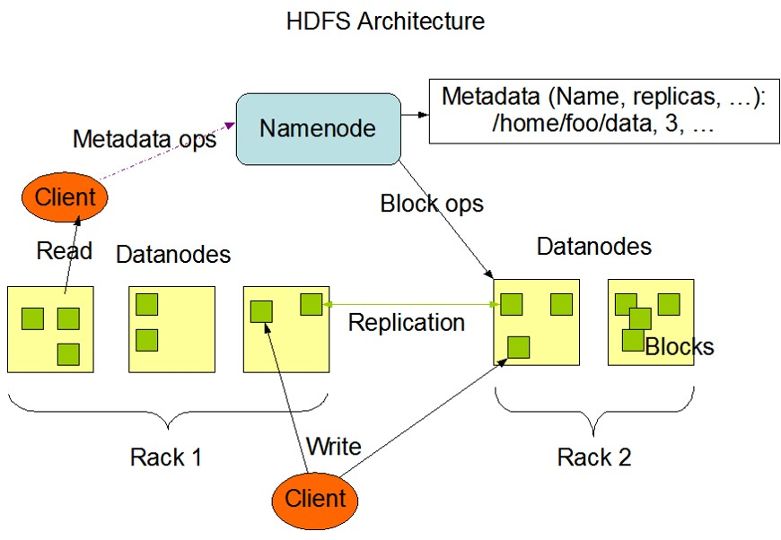

# 1. Hadoop
## 1.1 HDFS
### 1.1.1 理论知识
#### 1.1.1.1 存储模型
 - 文件线性按字节切割成块(block)，具有offset，id
 - 文件与文件的block大小可以不一样
 - 一个文件除最后一个block，其他block大小一致
 - block的大小依据硬件的I/O特性调整
 - block被分散存放在集群的节点中，具有location
 - Block具有副本(replication)，没有主从概念，副本不能出现在同一个节点
 - 副本是满足可靠性和性能的关键
 - 文件上传可以指定block大小和副本数，上传后只能修改副本数
 - 一次写入多次读取，不支持修改
 - 支持追加数据

#### 1.1.1.2 架构设计
 - HDFS是一个主从(Master/Slaves)架构
 - 由一个NameNode和一些DataNode组成
 - 面向文件包含：文件数据(data)和文件元数据(metadata)
 - NameNode负责存储和管理文件元数据，并维护了一个层次型的文件目录树
 - DataNode负责存储文件数据(block块)，并提供block的读写
 - DataNode与NameNode维持心跳，并汇报自己持有的block信息
 - Client和NameNode交互文件元数据和DataNode交互文件block数据

#### 1.1.1.2 角色功能
